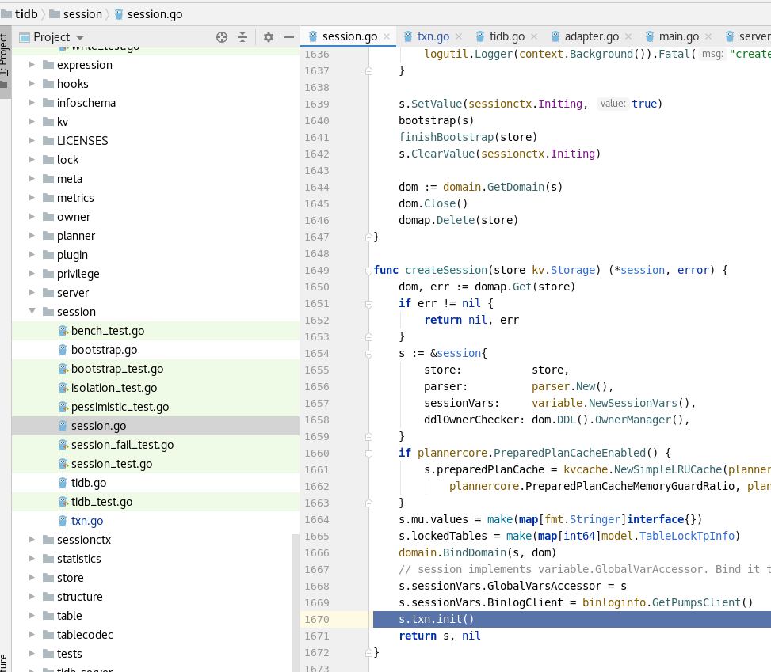
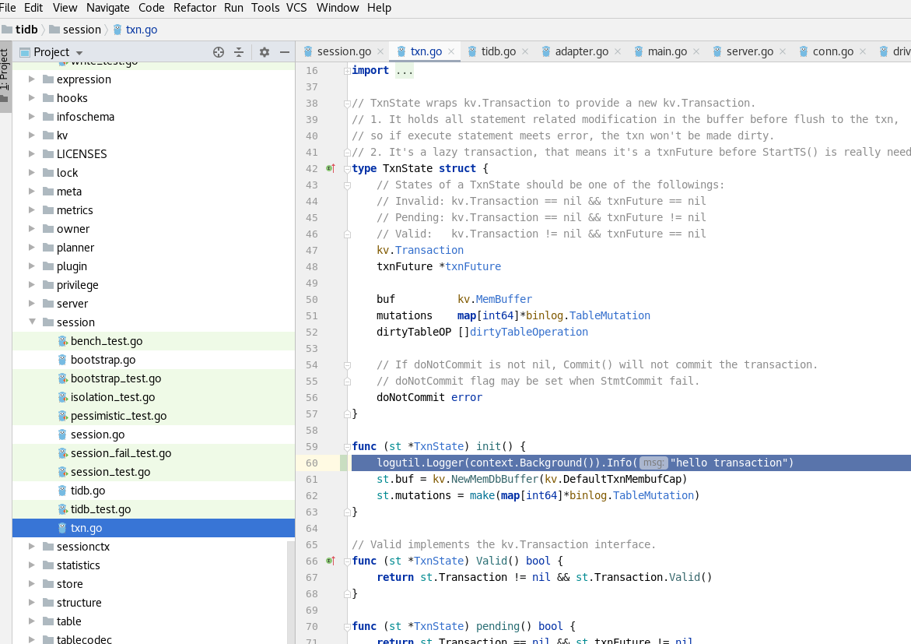

# 第一周的课程作业

作业题描述

```
分值：200

题目描述：

本地下载 TiDB，TiKV，PD 源代码，改写源码并编译部署以下环境：
* 1 TiDB
* 1 PD
* 3 TiKV

改写后：使得 TiDB 启动事务时，能打印出一个 “hello transaction” 的 日志

输出：一篇文章介绍以上过程

截止时间：本周日 24:00:00（逾期不给分）
作业提交方式：提交至个人 github ，将链接发送给 talent-plan@tidb.io
```

## 第零步 安装linux相关依赖包

yum install -y gcc-c++ git cmake3 golang

mv /usr/bin/cmake /usr/bin/cmake.bak && ln -s /usr/bin/cmake3 /usr/bin/cmake

cmake --version

```
cmake3 version 3.17.3

CMake suite maintained and supported by Kitware (kitware.com/cmake).
```


## 第一步 部署go环境

创建相关目录

mkdir -p ~/go && cd ~/go

下载go

wget https://golang.google.cn/dl/go1.15.linux-amd64.tar.gz

tar -zxf go1.15.linux-amd64.tar.gz

mv go go1.15

设置环境变量

vim ~/.bash_profile

```
export GOROOT="/root/go/go1.15" 
export GOPATH="/root/iceblue/go" 
export GOPROXY="https://goproxy.io" 
export GO111MODULE="on" 
export PATH=$GOROOT/bin:$GOPATH/bin:$PATH 
```

source ~/.bash_profile

## 第二步 部署rust环境

curl --proto '=https' --tlsv1.2 -sSf https://sh.rustup.rs | sh

```
Welcome to Rust!

This will download and install the official compiler for the Rust
programming language, and its package manager, Cargo.

Rustup metadata and toolchains will be installed into the Rustup
home directory, located at:

  /root/.rustup

This can be modified with the RUSTUP_HOME environment variable.

The Cargo home directory located at:

  /root/.cargo

This can be modified with the CARGO_HOME environment variable.

The cargo, rustc, rustup and other commands will be added to
Cargo's bin directory, located at:

  /root/.cargo/bin

This path will then be added to your PATH environment variable by
modifying the profile files located at:

  /root/.profile
  /root/.bash_profile

You can uninstall at any time with rustup self uninstall and
these changes will be reverted.

Current installation options:


   default host triple: x86_64-unknown-linux-gnu
     default toolchain: stable (default)
               profile: default
  modify PATH variable: yes

1) Proceed with installation (default)
2) Customize installation
3) Cancel installation
```

选择 1, 等待即可

rustc --version

```
rustc 1.45.2 (d3fb005a3 2020-07-31)
```

## 下载tidb,tikv,pd代码并编译

所有的操作都基于 3.0.15 版本

这里我把代码都放在了 /root/iceblue/go/src/pingcap 目录下

cd /root/iceblue/go/src/pingcap

### tidb

下载代码

git clone github.com:feloxx/tidb.git

切换分支

git checkout 3.0.15-cdp-high-performance

编译

gmake

```
CGO_ENABLED=1 GO111MODULE=on go build  -tags codes  -ldflags '-X "github.com/pingcap/parser/mysql.TiDBReleaseVersion=v3.0.15-dirty" -X "github.com/pingcap/tidb/util/printer.TiDBBuildTS=2020-08-16 11:41:10" -X "github.com/pingcap/tidb/util/printer.TiDBGitHash=9f55cf97f167c2a88b477e7547cc71ec650a8f12" -X "github.com/pingcap/tidb/util/printer.TiDBGitBranch=v3.0.15-cdp-high-performance" -X "github.com/pingcap/tidb/util/printer.GoVersion=go version go1.15 linux/amd64" ' -o bin/tidb-server tidb-server/main.go
Build TiDB Server successfully!
```

### pd

下载代码

git clone github.com:feloxx/pd.git

切换分支

git checkout 3.0.15-cdp-high-performance

编译

gmake

```
GO_ENABLED=0 go build -ldflags '-X "github.com/pingcap/pd/v3/server.PDReleaseVersion=v3.0.15" -X "github.com/pingcap/pd/v3/server.PDBuildTS=2020-08-16 11:44:37" -X "github.com/pingcap/pd/v3/server.PDGitHash=d0963de949a947528ad90111facdf440f7ad253a" -X "github.com/pingcap/pd/v3/server.PDGitBranch=v3.0.15-cdp-high-performance"' -o bin/pd-server cmd/pd-server/main.go
CGO_ENABLED=0 go build -ldflags '-X "github.com/pingcap/pd/v3/server.PDReleaseVersion=v3.0.15" -X "github.com/pingcap/pd/v3/server.PDBuildTS=2020-08-16 11:44:37" -X "github.com/pingcap/pd/v3/server.PDGitHash=d0963de949a947528ad90111facdf440f7ad253a" -X "github.com/pingcap/pd/v3/server.PDGitBranch=v3.0.15-cdp-high-performance"' -o bin/pd-ctl tools/pd-ctl/main.go
CGO_ENABLED=0 go build -o bin/pd-tso-bench tools/pd-tso-bench/main.go
CGO_ENABLED=0 go build -o bin/pd-recover tools/pd-recover/main.go
```

### tikv

下载代码

git clone github.com:feloxx/tikv.git

切换分支

git checkout 3.0.15-cdp-high-performance

编译

cargo build

## 第三步 修改代码





## 第四步 启动

准备好包与文件夹

```
drwxr-xr-x 2 root root         6 Aug 16 20:04 logs
drwxr-xr-x 2 root root         6 Aug 16 20:05 pd
-rwxr-xr-x 1 root root  33887629 Aug 16 18:42 pd-server
-rwxr-xr-x 1 root root  63082040 Aug 16 20:03 tidb-server
drwxr-xr-x 2 root root         6 Aug 16 20:04 tikv1
drwxr-xr-x 2 root root         6 Aug 16 20:04 tikv2
drwxr-xr-x 2 root root         6 Aug 16 20:04 tikv3
-rwxr-xr-x 1 root root 241397680 Aug 16 18:43 tikv-server
```

启动集群

nohup ./pd-server --data-dir=pd --log-file=logs/pd.log 2>&1 &

nohup ./tikv-server --addr="127.0.0.1:20171" --pd="127.0.0.1:2379" --data-dir=tikv1 --log-file=logs/tikv1.log 2>&1 &

nohup ./tikv-server --addr="127.0.0.1:20172" --pd="127.0.0.1:2379" --data-dir=tikv2 --log-file=logs/tikv2.log 2>&1 &

nohup ./tikv-server --addr="127.0.0.1:20173" --pd="127.0.0.1:2379" --data-dir=tikv3 --log-file=logs/tikv3.log 2>&1 &

nohup ./tidb-server --path="127.0.0.1:2379" --log-file=logs/tidb.log 2>&1 &

检查

ps -ef | grep server | grep -v grep

```
root      2909  2777  0 20:06 pts/0    00:00:06 ./pd-server --data-dir=pd --log-file=logs/pd.log
root      3245  2777  2 20:14 pts/0    00:00:04 ./tikv-server --addr=127.0.0.1:20171 --pd=127.0.0.1:2379 --data-dir=tikv1 --log-file=logs/tikv1.log
root      3312  2777  2 20:14 pts/0    00:00:04 ./tikv-server --addr=127.0.0.1:20172 --pd=127.0.0.1:2379 --data-dir=tikv2 --log-file=logs/tikv2.log
root      3377  2777  2 20:14 pts/0    00:00:04 ./tikv-server --addr=127.0.0.1:20173 --pd=127.0.0.1:2379 --data-dir=tikv3 --log-file=logs/tikv3.log
root      3520  2777  1 20:17 pts/0    00:00:00 ./tidb-server --path=127.0.0.1:2379 --log-file=logs/tidb.log
```


```

...
[2020/08/16 20:24:10.273 +08:00] [INFO] [server.go:377] ["connection closed"] [conn=9]
[2020/08/16 20:24:14.255 +08:00] [INFO] [txn.go:60] ["hello transaction"]
[2020/08/16 20:24:14.255 +08:00] [INFO] [server.go:374] ["new connection"] [conn=10] [remoteAddr=192.167.8.144:53347]
...

```
