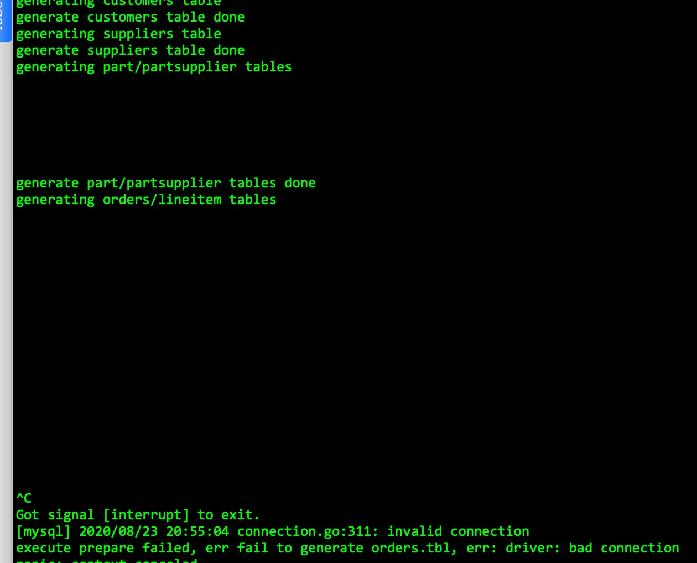

# 第二周的课程作业

作业题描述

```
分值：300

题目描述：

使用 sysbench、go-ycsb 和 go-tpc 分别对
 TiDB 进行测试并且产出测试报告。

测试报告需要包括以下内容：

* 部署环境的机器配置(CPU、内存、磁盘规格型号)，拓扑结构(TiDB、TiKV 各部署于哪些节点)
* 调整过后的 TiDB 和 TiKV 配置
* 测试输出结果
* 关键指标的监控截图
	    * TiDB Query Summary 中的 qps 与 duration
	    * TiKV Details 面板中 Cluster 中各 server 的 CPU 以及 QPS 指标
	    * TiKV Details 面板中 grpc 的 qps 以及 duration

输出：写出你对该配置与拓扑环境和 workload 下 TiDB 集群负载的分析，提出你认为的 TiDB 的性能的瓶颈所在(能提出大致在哪个模块即 可)

截止时间：下周二（8.25）24:00:00(逾期提交不给分)
```

## 第零步 部署tidb 并启动

### 环境拓扑

因为我们生产环境使用的3.0.15 和 原始ansible的方式，所以这里也使用相同的方式进行部署。

集群拓扑环境如下，以下为ansible中的inventory配置，多余的配置稍有省略

```
## TiDB Cluster Part
[tidb_servers]
tidb1 ansible_host=192.167.8.171 deploy_dir=/data1/bigdata/tidb
tidb2 ansible_host=192.167.8.172 deploy_dir=/data1/bigdata/tidb
tidb3 ansible_host=192.167.8.173 deploy_dir=/data1/bigdata/tidb

[tikv_servers]
tikv1 ansible_host=192.167.8.171 deploy_dir=/data1/bigdata/tikv
tikv2 ansible_host=192.167.8.172 deploy_dir=/data1/bigdata/tikv
tikv3 ansible_host=192.167.8.173 deploy_dir=/data1/bigdata/tikv

[pd_servers]
tipd1 ansible_host=192.167.8.171 deploy_dir=/data1/bigdata/tipd
tipd2 ansible_host=192.167.8.172 deploy_dir=/data1/bigdata/tipd
tipd3 ansible_host=192.167.8.173 deploy_dir=/data1/bigdata/tipd

...

tidb_version = v3.0.15

```

### 服务器型号

PowerEdge R720xd

cpu


内存


硬盘


网卡


### 虚拟机环境

proxmox 6.2-4


虚拟了三台虚拟机，每台配置如下


### 安装与配置

安装流程主要按照官方文档

https://docs.pingcap.com/zh/tidb/v3.0/online-deployment-using-ansible

**主要进行了一下配置修改**

- tidb 日志级别调整为error，开启prepared plan cache
- tikv 日志级别调整为error，关闭sync-log，虚拟内存位56G 调整storage.block-cache为30G

安装过程略过，安装结果如下：

```
Congrats! All goes well. :-)
environment check (deploy dir) ----------------------------------------- 12.47s
using rm command to clean up deploy_dir -------------------------------- 11.97s
cleaning up deploy dir -------------------------------------------------- 6.53s
stop node_exporter by systemd ------------------------------------------- 3.33s
stop node_exporter/blackbox_exporter by systemd ------------------------- 3.04s
stop prometheus by systemd ---------------------------------------------- 2.89s
stop TiKV by systemd ---------------------------------------------------- 2.89s
stop alertmanager by systemd -------------------------------------------- 2.82s
stop TiDB by systemd ---------------------------------------------------- 2.79s

Playbook finished: Sun Aug 23 11:22:27 2020, 66 total tasks.  0:01:30 elapsed. 
```

### 启动集群

```
Congrats! All goes well. :-)
wait for region replication complete ----------------------------------- 12.40s
environment check (deploy dir) ----------------------------------------- 10.53s
wait until the TiDB port is up ------------------------------------------ 7.78s
wait until the grafana port is up --------------------------------------- 7.09s
import grafana dashboards - run import script --------------------------- 5.89s
start grafana by systemd ------------------------------------------------ 5.77s
start node_exporter by systemd ------------------------------------------ 4.97s
start pushgateway by systemd -------------------------------------------- 4.46s
start blackbox_exporter by systemd -------------------------------------- 4.28s
start TiKV by systemd --------------------------------------------------- 4.20s

Playbook finished: Sun Aug 23 11:48:52 2020, 79 total tasks.  0:02:21 elapsed. 
```

简单测试


## 第一步 使用sysbench 测试tidb

mkdir tidbtest && mkdir -p tidbtest/sysbench tidbtest/go-ycsb tidbtest/go-tpc

### sysbench

基本是按照文档里的流程 https://docs.pingcap.com/zh/tidb/v3.0/benchmark-tidb-using-sysbench

cd tidbtest/sysbench/ && curl -s https://packagecloud.io/install/repositories/akopytov/sysbench/script.rpm.sh | sudo bash

sudo yum install -y sysbench

cd tidbtest/sysbench/ && vim config 

创建如下配置文件

```
mysql-host=192.167.8.171
mysql-port=4000
mysql-user=root
mysql-password=root
mysql-db=sbtest
time=600
threads=6
report-interval=10
db-driver=mysql
```

开始导入数据

```
sysbench --config-file=config oltp_point_select --tables=6 --table-size=10000000 prepare
```

前戏1

```
SELECT COUNT(pad) FROM sbtest1 USE INDEX (k_1);  
SELECT COUNT(pad) FROM sbtest2 USE INDEX (k_2);  
SELECT COUNT(pad) FROM sbtest3 USE INDEX (k_3);  
SELECT COUNT(pad) FROM sbtest4 USE INDEX (k_4);  
SELECT COUNT(pad) FROM sbtest5 USE INDEX (k_5);  
SELECT COUNT(pad) FROM sbtest6 USE INDEX (k_6);  
```

前戏2

```
ANALYZE TABLE sbtest1;  
ANALYZE TABLE sbtest2;  
ANALYZE TABLE sbtest3;  
ANALYZE TABLE sbtest4;  
ANALYZE TABLE sbtest5;  
ANALYZE TABLE sbtest6;  
```

测试 oltp_point_select

```
sysbench --config-file=config oltp_point_select --tables=6 --table-size=10000000 run
```

结果 oltp_point_select 


测试 oltp_update_index

```
sysbench --config-file=config oltp_update_index --tables=6 --table-size=10000000 run
```

结果 oltp_update_index


测试 oltp_read_only

```
sysbench --config-file=config oltp_read_only --tables=6 --table-size=10000000 run
```

结果 oltp_read_only


## 第二步 使用go-ycsb 测试tidb

准备数据

```
./go-ycsb load mysql -P workloads/workloada -p recordcount=1000000 -p mysql.host=192.167.8.171 -p mysql.user=root -p mysql.password=root -p mysql.port=4000 --threads 6
```


```
./go-ycsb run mysql -P workloads/workloada -p recordcount=1000000 -p mysql.host=192.167.8.171 -p mysql.user=root -p mysql.password=root -p mysql.port=4000 --threads 6
```

一共测试了3次


前面造了100万数据，太浪费时间了，试试10万数据

```
./go-ycsb load mysql -P workloads/workloadb -p recordcount=100000 -p mysql.host=192.167.8.171 -p mysql.user=root -p mysql.password=root -p mysql.port=4000 --threads 6
```


继续测试3次


后面的就不截图了，先把其他的测试跑完


## 第三步 使用go-tpc 测试tidb

先测tpcc的，搞28个仓库试试手

```
./go-tpc tpcc -H 192.167.8.171 -P 4000 -U root -p root -D tpcc --warehouses 28 prepare -T 6
```


开始测试

```
./go-tpc tpcc -H 192.167.8.171 -P 4000 -U root -p root -D tpcc --warehouses 28 run
```

tpmC只有280，感觉有点低呀。可能也是我配置太老了。


再测试一下 tpch的

我这里是56G内存一台虚拟机，sf我就搞个10G试试水把

```
./go-tpc tpch prepare -H 192.167.8.171 -P 4000 -U root -p root -D tpch --sf 10 --analyze
```

将近造了2个小时的数据，没时间等了，暂时先手动结束了。



```
./go-tpc tpch run -H 192.167.8.171 -P 4000 -U root -p root -D tpch --sf 4
```

经常在测试到第5个sql的时候就挂了，出现如下错误


感觉前面积攒太多测试的任务在里面，或者缓存没轻，或者没有gc不想等那10分钟了先重启下集群吧。（主要是在虚拟机的监控上来看，资源占用一直没有释放）

很明显看到内存有释放。


继续测一次

依旧不行，还是会挂，而且此时其他db节点是正常的。

比如我可以在另一个db节点来查看tpch Q5 sql的执行计划。


